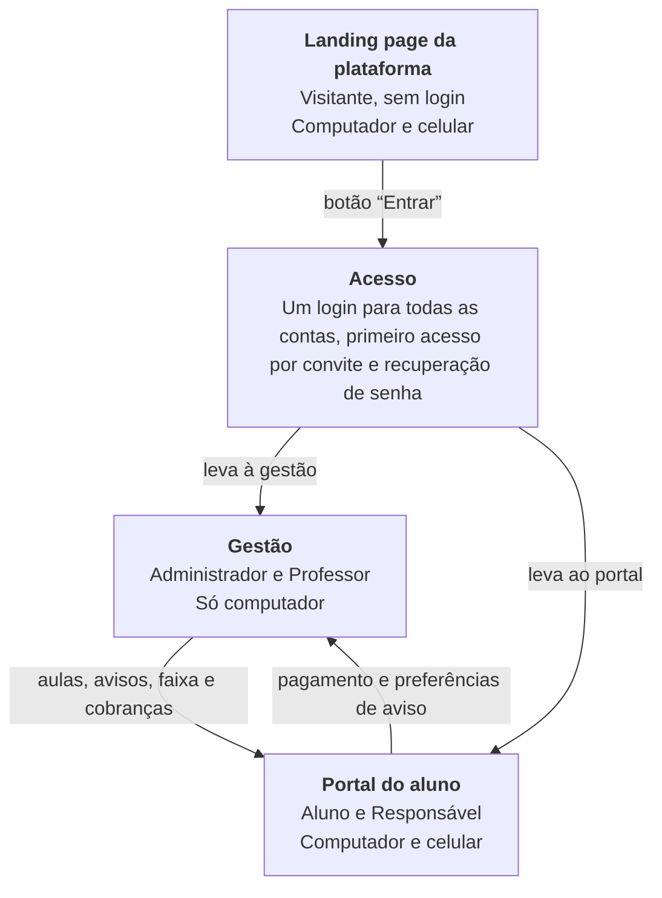

# Guia de desenvolvimento · Desktop · Visão geral

> Sistema de Gestão para Academia de Jiu-Jitsu · Versão 1.0 · 2 de outubro de 2026 · Acompanha os arquivos 1, 2 e 3: Gestão, Portal do aluno e Site e acesso

> **Atualização de escopo (07/10/2026, issue #14):** o site público de cada academia saiu do escopo; no lugar dele entra a landing page da plataforma (#96). O que estava escrito aparece riscado, com a atualização logo depois quando há.

Resumo dos três guias de desenvolvimento: Gestão, Portal do aluno e Site e acesso. O que o sistema faz, como as partes se ligam, em que ordem construir e o que ainda falta decidir.

| **39** | **301** | **259** | **61** | **77** |
| :---: | :---: | :---: | :---: | :---: |
| fases nos três guias | requisitos funcionais | regras de negócio | casos de uso | requisitos não funcionais |

[← Índice da documentação](README.md)

## Sobre este resumo

Este arquivo resume os três guias de desenvolvimento da parte desktop do sistema. Ele serve para entender o sistema inteiro em poucos minutos e para saber em qual guia procurar cada assunto.

Ele não substitui os guias. Os requisitos, as regras de negócio e os casos de uso completos, com os códigos, estão em cada um deles.

- **[A DEFINIR]** marca um ponto que depende de decisão da academia.
- _[sugestão]_ marca uma proposta que não veio da academia nem das telas e precisa de confirmação.

## O sistema em uma página

O sistema ajuda uma academia de Jiu-Jitsu a cuidar de alunos, aulas, graduações, mensalidades e avisos. Ele tem três partes, que usam o mesmo banco de dados e o mesmo login.

A gestão é o centro. Quase tudo nasce nela. O portal mostra ao aluno e ao responsável o que a gestão registrou. ~~O site apresenta a academia a quem ainda não é aluno.~~ _Atualização:_ A landing page da plataforma apresenta o sistema a quem ainda não o usa.

As setas mostram o que cada parte entrega à outra.

### As três partes

| Parte | Para quem | O que faz | Onde funciona |
| --- | --- | --- | --- |
| Gestão | Administrador e Professor | Cadastros, agenda, graduações, financeiro, comunicados, relatórios e configurações. | Só no computador |
| Portal do aluno | Aluno e Responsável | Horários, avisos, graduação, mensalidades e pagamento online. | Computador e celular |
| Site e acesso | Visitante e todas as contas | ~~Site da academia, pedido de aula experimental, login, primeiro acesso e recuperação de senha.~~ _Atualização:_ Login, primeiro acesso e recuperação de senha, e a landing page da plataforma. | Computador e celular |

### Quem usa

| Quem | Onde entra | O que faz |
| --- | --- | --- |
| Administrador | Gestão | Tem acesso total: cadastros, financeiro, configurações, importação e exportação. |
| Professor | Gestão | Vê só as turmas em que dá aula: alunos, aulas, graduações e avisos. Não acessa o financeiro. |
| Aluno | Portal | Vê os próprios horários, avisos, graduação e mensalidades, e paga online. |
| Responsável | Portal | Faz o mesmo por um ou mais alunos menores ligados à sua conta. |
| Visitante | Site, sem login | Conhece a academia e pede uma aula experimental. |

## Os três guias

Cada parte tem o seu guia. Os três seguem o mesmo formato: fases na ordem de construção e, em cada fase, objetivo, dependências, telas, dados, passo a passo, requisitos funcionais, regras de negócio, casos de uso e a lista “Pronto quando”.

| Guia | Páginas | Fases | RF | RN | UC | RNF | Em aberto |
| --- | --- | --- | --- | --- | --- | --- | --- |
| Gestão | 66 | 25 | 183 | 144 | 37 | 26 | 12 |
| Portal do aluno | 26 | 8 | 57 | 56 | 13 | 23 | 12 |
| Site e acesso | 26 | 6 | 61 | 59 | 11 | 28 | 13 |
| **Total** | **118** | **39** | **301** | **259** | **61** | **77** | **37** |

RF são os requisitos funcionais, RN as regras de negócio, UC os casos de uso e RNF os requisitos não funcionais. “Em aberto” é o número de decisões pendentes listadas em cada guia. Alguns pontos se repetem entre os guias.

### Como as partes se ligam

A gestão é a fonte de quase todos os dados. ~~O portal e o site leem o que ela registra e devolvem só três coisas: o pagamento, as preferências de aviso e o pedido de aula experimental.~~ _Atualização:_ O portal lê o que ela registra e devolve só duas coisas: o pagamento e as preferências de aviso.

| O quê | Nasce em | Aparece em |
| --- | --- | --- |
| Nome, contato, logo e cor da academia | Gestão › Configurações › Academia | ~~Portal, site e comunicados~~ _Atualização:_ Portal e comunicados |
| Contas e convites | Gestão › Usuários e permissões | Login e Primeiro acesso |
| Turmas, aulas e mudanças na agenda | Gestão › Operação | ~~Agenda do portal e horários do site~~ _Atualização:_ Agenda do portal |
| Professores e faixa atual | Gestão › Pessoas | ~~Equipe do site e agenda do portal~~ _Atualização:_ Agenda do portal |
| Comunicados | Gestão › Comunicação | Avisos do portal, e-mail e WhatsApp |
| Graduações | Gestão › Operação | Minhas informações e Início do portal |
| Plano, benefícios e mensalidades | Gestão › Financeiro | Financeiro do portal |
| Pagamento online | Portal › Financeiro | Mensalidades da gestão, com baixa automática, notificação e histórico |
| Preferências de aviso por e-mail | Portal › Minhas informações e Primeiro acesso | Envio de avisos e lembretes |
| ~~Pedido de aula experimental~~ | ~~Site público~~ | ~~Aulas experimentais da gestão, notificação e histórico~~ _Removido do escopo (#14)._ |

## Gestão em resumo

A gestão é o painel de quem administra a academia. Ela é usada só no computador e é organizada pelo trabalho do dia a dia, não pelas tabelas do banco. São 25 fases, em seis etapas.

### Módulos

| Módulo | O que faz | Fases |
| --- | --- | --- |
| Base do sistema | Login, perfis, menu lateral, padrões de tela e registro de tudo o que é alterado. | 1 |
| Início | Painel do dia: o que acontece hoje e o que pede atenção. | 17 |
| Pessoas | Alunos, com consulta, cadastro, situação e financeiro de cada um, e Professores. | 7 · 4 |
| Operação | Agenda de aulas, Turmas, Aulas experimentais e Graduações. | 11 · 6 · 12 · 8 |
| Financeiro | Visão geral, Mensalidades, Despesas e Planos e benefícios. | 16 · 14 · 15 · 5 e 13 |
| Comunicação | Comunicados e Grupos de WhatsApp por turma. | 10 · 9 |
| Relatórios | Andamento da academia ao longo dos meses. | 21 |
| Configurações | Academia, Usuários e permissões, Integrações, Histórico de alterações e Importar e exportar dados. | 2 · 3 · 24 · 22 · 23 |
| Menu | Notificações, Busca e Ajuda. | 19 · 20 · 25 |
| Visão do professor | Início do professor e Meus alunos. | 18 |

### Etapas, na ordem de construção

| Etapa | Fases | O que entrega |
| --- | --- | --- |
| A · Fundação | 1 a 3 | Acesso, permissões, menu, padrões de tela, dados da academia e usuários. |
| B · Cadastros básicos | 4 a 7 | Professores, planos, turmas e alunos. |
| C · Operação e comunicação | 8 a 12 | Graduações, grupos, comunicados, agenda e aulas experimentais. |
| D · Financeiro | 13 a 16 | Descontos e bolsas, mensalidades, despesas e visão geral do financeiro. |
| E · Acompanhamento | 17 a 22 | Início, visão do professor, notificações, busca, relatórios e histórico. |
| F · Dados e fechamento | 23 a 25 | Importar e exportar dados, integrações e ajuda. |

### O que guardar da gestão

- A tela de Alunos é o ponto central: dali se consulta e se age sobre cada aluno sem trocar de tela.
- O financeiro separa a regra do resultado. Planos e benefícios são as regras. A mensalidade é o resultado.
- As cobranças do mês são geradas pelo administrador, com revisão antes. Gerar de novo não duplica.
- O professor tem uma visão própria, só com as suas turmas e sem o financeiro.

## Portal do aluno em resumo

O portal é a área do aluno e do responsável, no computador e no celular. Ele quase não tem dados próprios: mostra à pessoa certa o que a gestão registrou. São 8 fases, em quatro etapas.

| Parte | O que mostra | Fases |
| --- | --- | --- |
| Estrutura | Acesso, navegação e conta de responsável | 1 e 2 |
| Início | Próxima aula, mensalidade, avisos recentes e graduação | 8 |
| Agenda | Horários em que o aluno pode treinar na semana | 4 |
| Financeiro | Mensalidade, composição do valor, histórico e pagamento online | 6 e 7 |
| Minhas informações | Dados, treinos, plano e benefícios, graduação e preferências de e-mail | 3 |
| Avisos (sino) | Comunicados da academia | 5 |

As etapas são: A, base do portal (fases 1 e 2); B, consulta (fases 3 a 5); C, financeiro e pagamento (fases 6 e 7); e D, início (fase 8).

- A conta só vê os alunos ligados a ela. O servidor confere isso em toda consulta.
- O pagamento online depende do provedor, que ainda não foi escolhido. **[A DEFINIR]**
- O aluno não marca presença, não reserva aula e não vê progresso de graduação.

## Site e acesso em resumo

Esta parte reúne o que fica fora da gestão e do portal: ~~o site que qualquer pessoa abre sem login e as telas por onde todos entram. São 6 fases, em duas etapas.~~ _Atualização:_ as telas por onde todos entram e a landing page da plataforma. São 3 fases de acesso; as fases 4 a 6, do site público, saíram do escopo.

| Parte | O que faz | Fase |
| --- | --- | --- |
| Acesso › Login | Entrar com e-mail e senha e ser levado à gestão ou ao portal | 1 |
| Acesso › Primeiro acesso | Criar a senha a partir do convite enviado pela gestão | 2 |
| Acesso › Recuperar senha | Pedir um link por e-mail e criar uma nova senha | 3 |
| ~~Site público › Página da academia~~ | ~~Apresentação, modalidades, dúvidas e contato~~ | ~~4~~ _Removido do escopo (#14)._ |
| ~~Site público › Horários e equipe~~ | ~~Grade de horários e professores, lidos da gestão~~ | ~~5~~ _Removido do escopo (#14)._ |
| ~~Site público › Pedido de aula experimental~~ | ~~Formulário que entrega o pedido à gestão~~ | ~~6~~ _Removido do escopo (#14)._ |

~~As etapas são: A, acesso (fases 1 a 3); e B, site público (fases 4 a 6).~~ _Atualização:_ A etapa A, acesso, tem as fases 1 a 3; a etapa B, site público (fases 4 a 6), saiu do escopo. O acesso é feito no começo do projeto, junto com as primeiras fases da gestão.

- O login é um só. O sistema leva cada conta para a gestão ou para o portal.
- ~~O site não tem cadastro próprio: contato, horários e equipe vêm da gestão.~~ _Removido do escopo (#14)._
- ~~O pedido de aula não marca a aula. Quem marca é a academia, na gestão.~~ _Removido do escopo (#14)._

## Regras que valem para o sistema inteiro

Estas são as regras que mais moldam o sistema. Elas aparecem nos três guias e não podem ser contrariadas por nenhuma tela.

### Tatame

- Não existe frequência nem presença. Não há chamada, check-in nem percentual de aulas em nenhuma parte.
- A graduação é decisão do mestre. O sistema informa e registra. Não sugere quem está apto, não mostra progresso e não avisa que “faltam X aulas”.
- As turmas combinam tipo e período: Infantil, Juvenil e Adulto, de manhã, à tarde e à noite.
- O aluno tem uma turma principal e pode treinar em outros horários. _[quase certo: confirmar com a academia]_
- Quem faz aula experimental não é aluno: não tem cobrança, plano nem conta. O caminho da matrícula ainda não foi definido. **[A DEFINIR]**

### Financeiro

- A mensalidade é o plano menos os benefícios. Ninguém digita o valor.
- Não existe desconto por faixa. A graduação não muda o preço.
- Os benefícios são de dois tipos: desconto individual, em reais, e bolsa, em percentual.
- A forma de combinar dois benefícios do mesmo aluno ainda não foi definida. **[A DEFINIR]**
- A cobrança guarda a composição do valor no momento em que foi gerada e não muda depois.
- Aluno pausado, aluno inativo e aluno com bolsa integral não recebem cobrança.
- Só existe pagamento do valor inteiro, sem juros nem multa, até a academia decidir. **[A DEFINIR]**

### Comunicação

- Os canais são o portal, o e-mail e o WhatsApp, com um grupo por turma.
- O portal recebe sempre. O e-mail vai para quem não desligou os avisos.
- O WhatsApp não é automático: o sistema abre a conversa com a mensagem pronta. **[A DEFINIR: envio automático]**
- Avisos, lembretes e cobranças de aluno menor vão para o responsável.

### Acesso e dados

- Toda conta nasce de um convite enviado pela gestão. Não existe cadastro aberto.
- A permissão e o vínculo são conferidos no servidor. Esconder um botão não basta.
- Tudo o que altera dados fica no histórico, que ninguém edita nem apaga. ~~Vale para a gestão, o portal e o site.~~ _Atualização:_ Vale para a gestão e o portal.
- Nada é digitado duas vezes. ~~O portal e o site leem os dados da gestão.~~ _Atualização:_ O portal lê os dados da gestão.
- Aluno nunca é excluído. As situações são Ativo, Pausado e Inativo, e o histórico fica.
- Só o administrador importa e exporta dados. Os dados pessoais só saem quando marcados.

## Requisitos não funcionais em resumo

Os três guias somam 77 requisitos não funcionais. Os temas são os mesmos nos três.

| Tema | O que vale |
| --- | --- |
| Uso | Texto em português simples, sem termos técnicos. A gestão é só para computador, a partir de 1280 px. O portal e o site funcionam no computador (1440 px) e no celular (390 px). Tudo pode ser usado só com o teclado, com contraste adequado (nível AA). |
| Desempenho | Telas e listas respondem em até 2 segundos, e ~~a primeira parte do site aparece em até 2,5 segundos~~ _Atualização:_ a primeira parte da landing page aparece em até 2,5 segundos. As listas são paginadas. _[sugestão: confirmar as metas]_ |
| Segurança e privacidade | Acesso só com login, senha guardada com hash e conexão sempre por HTTPS. Os dados de cartão não passam pelo servidor da academia. O tratamento de dados segue a LGPD, com atenção aos dados de menores. |
| Confiabilidade | Nada se repete por engano: cobrança, pagamento ou pedido. As operações em lote gravam tudo ou nada. A falha de um serviço de fora não perde a operação. As mensagens de erro dizem o que aconteceu e o que fazer. |
| Manutenção | Uma só API e as mesmas regras para as três partes. Cada regra de negócio tem um teste automatizado. O código de pagamento fica isolado, para o provedor poder ser trocado. Existe um ambiente de teste separado. |
| Compatibilidade | Versões atuais de Chrome, Edge, Firefox e Safari. Formatos brasileiros de data, moeda e telefone, no fuso de Brasília. |

### O que não faz parte do sistema

- Frequência e presença.
- Graduação automática ou sugerida pelo sistema.
- Desconto por faixa.
- Matrícula online, contrato e termo de responsabilidade. O fluxo ainda não foi levantado com a academia.
- Resultado da aula experimental.
- Loja, ranking e chat.
- Reserva de vaga ou confirmação de aula pelo aluno.
- Cadastro aberto pelo site.
- Gestão no celular e gestão de várias unidades.
- Aplicativo instalado. Tudo abre no navegador.

## Ordem de desenvolvimento

Os guias não são feitos um depois do outro. As fases dos três se intercalam, porque o portal e o site dependem do que a gestão já tem pronto. Esta é uma ordem possível para o sistema inteiro. _[sugestão]_

### Fase 0 · Antes de tudo

- Tomar as decisões técnicas: linguagem, banco de dados, hospedagem, serviço de e-mail e ~~endereço do site~~ _Atualização:_ endereço do sistema.
- Montar o ambiente de teste, separado do de produção, e as contas de teste de cada perfil.
- Levar à academia as decisões em aberto que mais pesam.

### Os oito passos

| Passo | Gestão ou portal | Site e acesso | O que fica pronto |
| --- | --- | --- | --- |
| **1** | Gestão, Fase 1 | Site e acesso, Fase 1 | Entrar no sistema. |
| **2** | Gestão, Fase 2 | ~~Site e acesso, Fase 4~~ _Atualização:_ — | ~~Dados da academia e site no ar, ainda sem horários e equipe.~~ _Atualização:_ Dados da academia. |
| **3** | Gestão, Fase 3 | Site e acesso, Fases 2 e 3 | Convites, primeiro acesso e recuperação de senha. |
| **4** | Gestão, Fases 4 a 7 | — | Professores, planos, turmas e alunos. |
| **5** | Gestão, Fases 8 a 12 | ~~Site e acesso, Fases 5 e 6~~ _Atualização:_ — | ~~Operação e comunicação. O site ganha horários, equipe e pedido de aula.~~ _Atualização:_ Operação e comunicação. |
| **6** | Gestão, Fases 13 a 16 | — | Financeiro. |
| **7** | Portal, Fases 1 a 6 | — | Base do portal, consulta e financeiro do aluno. |
| **8** | Gestão, Fases 17 a 25 | Portal, Fases 7 e 8 | Acompanhamento, dados, pagamento online e Início do portal. |

### O que trava e o que não trava

- A gestão vem primeiro. ~~Ela é a fonte dos dados do portal e do site.~~ _Atualização:_ Ela é a fonte dos dados do portal.
- O login é feito junto com a Fase 1 da Gestão. Sem ele ninguém entra.
- ~~O site pode ir ao ar cedo. A página da academia só precisa dos dados de Configurações › Academia.~~ _Removido do escopo (#14)._
- O financeiro da gestão não depende da operação. As duas etapas podem ser feitas em paralelo.
- O pagamento online é a única fase travada por uma decisão: o provedor. Sem ele, o portal mostra as cobranças e o pagamento continua sendo feito na academia.
- Dentro de cada guia, uma fase só começa depois de conferida a lista “Pronto quando” da anterior.

## Decisões em aberto

Cada guia traz a sua lista: 12 na Gestão, 12 no Portal e 13 no Site e acesso. Alguns pontos se repetem entre os guias. Abaixo estão os que mais pesam. Todos têm solução provisória, e só o provedor de pagamento trava uma fase inteira.

| O que falta decidir | Onde aparece | Enquanto não decide |
| --- | --- | --- |
| Fluxo de matrícula: quando alguém vira aluno, contrato e pagamento inicial | Gestão | Cadastro simples de aluno. “Novo aluno” e “Registrar como aluno” ficam sem fluxo próprio. |
| Como combinar benefícios quando o aluno tem mais de um | Gestão | O sistema pede a decisão caso a caso ao gerar as cobranças. |
| Provedor de pagamento online e quem arca com as taxas | Gestão e Portal | Pagamento lançado à mão na gestão. O portal só mostra as cobranças. |
| Pagamento parcial, juros e multa | Gestão e Portal | Só pagamento do valor inteiro, sem juros nem multa. |
| Envio automático pelo WhatsApp | Gestão | Portal e e-mail são automáticos. O WhatsApp abre com a mensagem pronta. |
| Aluno treinar em vários horários (quase certo) | Gestão e Portal | Turma principal mais outros horários, como desenhado. |
| ~~Conteúdo do site: textos que faltam, números do topo e modalidades Kids e No-Gi~~ | ~~Site e acesso~~ | ~~Só publicar o que a academia confirmar. Mostrar Infantil, Juvenil e Adulto.~~ _Removido do escopo (#14)._ |
| Contas: professor que também é aluno, menor com conta própria, mais de um responsável e aluno inativo | Portal e Site e acesso | Um e-mail para cada papel. Só o responsável tem conta. O aluno inativo consulta o histórico. |
| Prazo do convite, tempo de sessão e exigências da senha | Os três guias | Valores provisórios. Senha como no desenho. |
| Lista de faixas e graus de crianças e jovens | Gestão | Usar as faixas do desenho, em lista configurável. |
| Política de privacidade e guarda de dados | Os três guias | Validar com quem cuida do jurídico da academia antes de divulgar. |
| Decisões técnicas: linguagem, banco, hospedagem, e-mail e ~~endereço do site~~ _Atualização:_ endereço do sistema | Todo o sistema | Resolver na Fase 0, antes de começar. |

### Próximos passos

1. Levar à academia as decisões em aberto, começando por matrícula, combinação de benefícios e provedor de pagamento.
2. Resolver a Fase 0: decisões técnicas, ambiente de teste e contas de teste.
3. Começar pela Fase 1 da Gestão, junto com o login.
4. Seguir os oito passos, conferindo a lista “Pronto quando” de cada fase antes de avançar.
